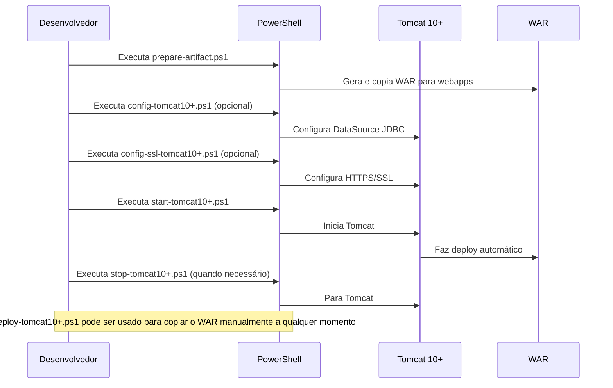

# csonline

Projeto Java para gestão de entregas, clientes, usuários, preços e SMS.

## Principais Tecnologias

- Jakarta EE 10
- JPA (Jakarta Persistence API)
- EclipseLink (JPA Provider)
- Jersey (JAX-RS)
- HSQLDB (HyperSQL Database)
- Log4j 2
- Swagger/OpenAPI
- JUnit 5, Mockito

## Como executar


## Como executar


### Como executar no Tomcat 10+ (Windows/PowerShell)

Scripts automatizados estão disponíveis na raiz do projeto:

#### Diagrama de Sequência dos Scripts



**Resumo da ordem típica:**

1. `prepare-artifact.ps1` → 2. `config-tomcat10+.ps1` (opcional) → 3. `config-ssl-tomcat10+.ps1` (opcional) → 4. `start-tomcat10+.ps1` → 5. `stop-tomcat10+.ps1`
   - Use `deploy-tomcat10+.ps1` se quiser apenas copiar o WAR manualmente.

1. **Preparar o artefato WAR e copiar para o Tomcat:**
   ```powershell
   pwsh ./prepare-artifact.ps1 [-DskipTests]
   ```
   Gera o arquivo `target/csonline-1.0-SNAPSHOT.war` e copia para `server\apache-tomcat-10.1.43\webapps`.

2. **Iniciar o Tomcat:**
   ```powershell
   pwsh ./start-tomcat10+.ps1
   ```
   Inicia o Tomcat 10+ em http://localhost:8080/.

3. **Parar o Tomcat:**
   ```powershell
   pwsh ./stop-tomcat10+.ps1
   ```
   Para o Tomcat 10+.

4. **Deploy manual do WAR (opcional):**
   ```powershell
   pwsh ./deploy-tomcat10+.ps1
   ```
   Copia o WAR para a pasta webapps do Tomcat.

5. **Configurar DataSource JDBC (opcional):**
   ```powershell
   pwsh ./config-tomcat10+.ps1
   ```
   Copia o driver JDBC e configura o DataSource no Tomcat (exemplo para HSQLDB).

6. **Configurar HTTPS/SSL (opcional):**
   ```powershell
   pwsh ./config-ssl-tomcat10+.ps1
   ```
   Gera um certificado autoassinado, configura o conector SSL no Tomcat (porta 8443) e orienta sobre reinício do servidor. Após executar, acesse: https://localhost:8443/csonline/

---

## Logging

Os logs são gravados em `logs/app.log` (configurável via `log4j2.xml`).

## Documentação da API

Swagger disponível em `/api/openapi.json`.

Acesse a interface Swagger UI em:  
`http://localhost:8080/api/openapi.json`
(ajuste a porta conforme sua configuração Tomcat)

Os endpoints REST estão disponíveis em:  
- `/api/users`
- `/api/customers`
- `/api/couriers`
- `/api/deliveries`
- `/api/sms`
- `/api/login`

## Documentação Completa

Consulte o arquivo [INDEX.md](doc/INDEX.md) para uma documentação detalhada do projeto.

## Estrutura de Pastas

- `src/main/java/com/caracore/cso/controller` - Controllers REST
- `src/main/java/com/caracore/cso/service` - Serviços de negócio
- `src/main/java/com/caracore/cso/repository` - Repositórios JPA/EclipseLink
- `src/main/java/com/caracore/cso/entity` - Entidades JPA
- `src/main/resources` - Configurações (ex: `log4j2.xml`, `persistence.xml`)
- `src/test/java` - Testes unitários

## Configuração

- Edite `src/main/resources/log4j2.xml` para ajustar o log.
- Edite `src/main/resources/persistence.xml` para configurar JPA/EclipseLink.
- Banco de dados HSQLDB em memória por padrão (configurável em `src/main/resources/persistence.xml` e `application.properties`).

## Contato

Para dúvidas ou sugestões, abra uma issue.

## Licença

Este projeto está licenciado sob a licença MIT. Veja o arquivo [LICENSE](LICENSE) para mais detalhes.
