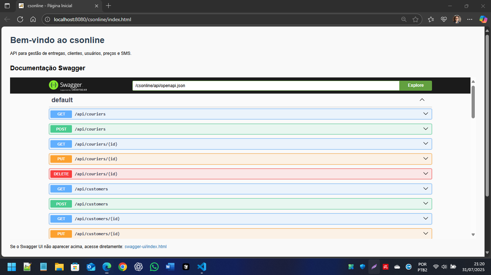
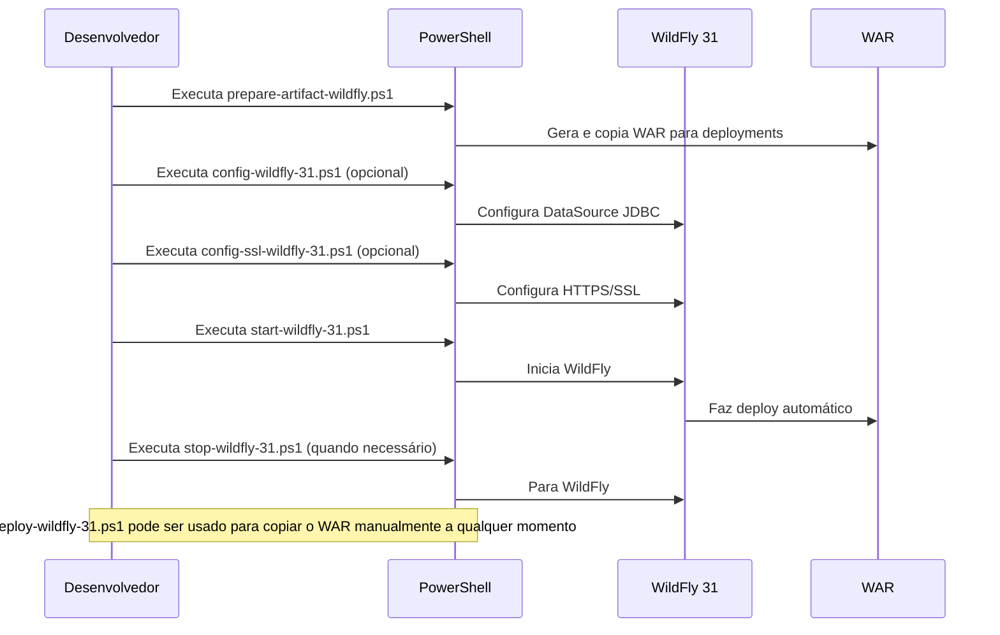

# csonline

Projeto Java para gestão de entregas, clientes, usuários, preços e SMS.

## Principais Tecnologias


- Jakarta EE 10
- JPA (Jakarta Persistence API)
- EclipseLink (JPA Provider)
- Jersey (JAX-RS)
- HSQLDB (HyperSQL Database)
- Log4j 2
- Swagger/OpenAPI
- JUnit 5, Mockito
- Vue 3 + Vite (SPA front-end)


## Sucesso do Deploy: index.html e Swagger UI


O deploy no WildFly 31 foi realizado com sucesso. Agora o sistema conta com:

- Página principal (`index.html`) servida pelo front-end Vue SPA, com navegação dinâmica (login, menu principal, gestão de usuários, logout).
- Documentação interativa das APIs (Swagger UI) acessível para testes e validação dos endpoints REST.

- Página inicial: [http://localhost:8080/csonline/index.html](http://localhost:8080/csonline/index.html)
- Swagger UI: [http://localhost:8080/csonline/swagger-ui/index.html](http://localhost:8080/csonline/swagger-ui/index.html)

Exemplo real do Swagger UI em funcionamento:



## Como executar

## Como executar o front-end Vue SPA

1. Instale as dependências do front-end:
   ```powershell
   cd frontend
   npm install
   ```
2. Execute em modo desenvolvimento:
   ```powershell
   npm run dev
   ```
   Acesse em [http://localhost:5173](http://localhost:5173) (porta padrão Vite).
3. Para build de produção:
   ```powershell
   npm run build
   ```
   Os arquivos finais estarão em `frontend/dist`.
4. Use o script PowerShell para copiar o build para o backend:
   ```powershell
   pwsh ./src/build-frontend.ps1
   ```
   Isso copia o conteúdo de `dist/` para `src/main/webapp/` e serve o SPA junto ao backend.


### Como executar no WildFly 31 (Windows/PowerShell)

Scripts automatizados estão disponíveis na raiz do projeto:

#### Diagrama de Sequência dos Scripts



**Resumo da ordem típica:**

1. `prepare-artifact-wildfly.ps1` → 2. `config-wildfly-31.ps1` (opcional) → 3. `config-ssl-wildfly-31.ps1` (opcional) → 4. `start-wildfly-31.ps1` → 5. `stop-wildfly-31.ps1`
   - Use `deploy-wildfly-31.ps1` se quiser apenas copiar o WAR manualmente.

1. **Preparar o artefato WAR e copiar para o WildFly:**
   ```powershell
   pwsh ./prepare-artifact-wildfly.ps1 [-DskipTests]
   ```
   Gera o arquivo `target/csonline.war` e copia para `server\wildfly-31.0.1.Final\standalone\deployments`.

2. **Iniciar o WildFly:**
   ```powershell
   pwsh ./start-wildfly-31.ps1
   ```
   Inicia o WildFly 31 em http://localhost:8080/.

3. **Parar o WildFly:**
   ```powershell
   pwsh ./stop-wildfly-31.ps1
   ```
   Para o WildFly 31.

4. **Deploy manual do WAR (opcional):**
   ```powershell
   pwsh ./deploy-wildfly-31.ps1
   ```
   Copia o WAR para a pasta deployments do WildFly.

5. **Configurar DataSource JDBC (opcional):**
   ```powershell
   pwsh ./config-wildfly-31.ps1
   ```
   Copia o driver JDBC e configura o DataSource no WildFly (exemplo para HSQLDB).

6. **Configurar HTTPS/SSL (opcional):**
   ```powershell
   pwsh ./config-ssl-wildfly-31.ps1
   ```
   Gera um certificado autoassinado, configura o HTTPS no WildFly (porta 8443) e orienta sobre reinício do servidor. Após executar, acesse: https://localhost:8443/csonline/

---


## Logging

Os logs customizados da aplicação são gravados em `logs/app.log` (relativo à raiz do projeto, configurado via scripts e logging do WildFly).

Para visualizar o log:

- Acesse o arquivo diretamente: `logs/app.log`
- Ou, via CLI do WildFly:
  ```powershell
  pwsh ./config-log-wildfly-31.ps1   # (executa a configuração, se necessário)
  Get-Content ./logs/app.log -Wait   # (acompanha o log em tempo real)
  ```

Além disso, o log padrão do servidor WildFly está em:
`server/wildfly-31.0.1.Final/standalone/log/server.log`

Você pode ajustar o formato e destino do log customizado editando o script ou via console administrativo do WildFly.

## Documentação da API


Swagger disponível em `/api/openapi.json`.

Acesse a interface Swagger UI em:  
`http://localhost:8080/csonline/swagger-ui/index.html`
(ajuste a porta conforme sua configuração WildFly)

Os endpoints REST estão disponíveis em:  
- `/api/users`
- `/api/customers`
- `/api/couriers`
- `/api/deliveries`
- `/api/sms`
- `/api/login`

## Documentação Completa

Consulte o arquivo [doc/INDEX.md](doc/INDEX.md) para uma documentação detalhada do projeto, incluindo arquitetura, navegação, integração e segurança do front-end SPA.

## Estrutura de Pastas


- `src/main/java/com/caracore/cso/controller` - Controllers REST
- `src/main/java/com/caracore/cso/service` - Serviços de negócio
- `src/main/java/com/caracore/cso/repository` - Repositórios JPA/EclipseLink
- `src/main/java/com/caracore/cso/entity` - Entidades JPA
- `src/main/resources` - Configurações (ex: `log4j2.xml`, `persistence.xml`)
- `src/test/java` - Testes unitários
- `frontend/` - Front-end SPA Vue 3 + Vite
  - `src/components/` - Componentes Vue (Login, MainLayout, UserManagement, Logout)
  - `dist/` - Build final do front-end

## Configuração


- Edite `src/main/resources/log4j2.xml` para ajustar o log.
- Edite `src/main/resources/persistence.xml` para configurar JPA/EclipseLink.
- Banco de dados HSQLDB em memória por padrão (configurável em `src/main/resources/persistence.xml` e `application.properties`).
- Para customizar o front-end, edite os componentes Vue em `frontend/src/components/`.

## Contato


Para dúvidas ou sugestões, abra uma issue.

---

**Observação:** O front-end SPA está em evolução, com navegação, integração e segurança planejadas. Consulte a documentação técnica para acompanhar os próximos passos e novas funcionalidades.

## Licença

Este projeto está licenciado sob a licença MIT. Veja o arquivo [LICENSE](LICENSE) para mais detalhes.
