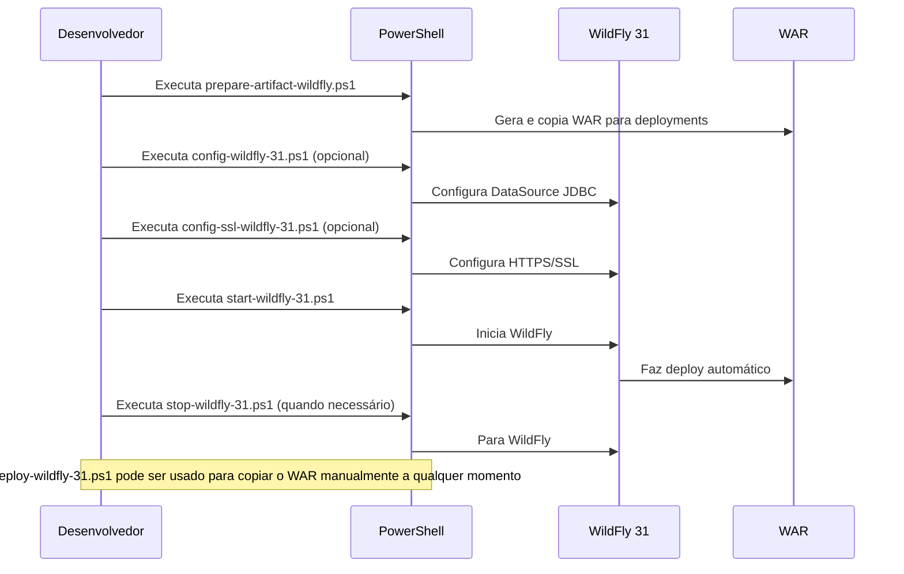

# CSOnline - Sistema de Gestão de Entregas

Sistema completo para gestão de entregas, entregadores, empresas (business/centros de distribuição), equipes, preços e comunicação via SMS/WhatsApp. Desenvolvido com Jakarta EE 10 no backend e Vue 3 + Vite no frontend.

## Funcionalidades Implementadas

### **Sistema Completo de Gestão**

**Frontend Vue 3 SPA - 100% Funcional:**
- **Gestão de Usuários** - CRUD completo para administradores do sistema
- **Gestão de Entregadores** - Cadastro e controle de couriers com comissões
- **Gestão de Empresas (Business)** - Centros de distribuição (business) com endereços
- **Gestão de Entregas** - Sistema completo com status, filtros e rastreamento
- **Gestão de Equipes** - Vinculação de entregadores aos centros de distribuição
- **Gestão de SMS/WhatsApp** - Sistema de mensagens com templates para entregas
- **Gestão de Preços** - Tabelas de preços por empresa (business), veículo e localização
- **Sistema de Login/Logout** - Autenticação com navegação completa

### **Recursos Técnicos:**
- Interface responsiva e moderna
- Dashboard com estatísticas em cada módulo
- Sistema de filtros e busca avançada
- Modais para criação/edição/visualização
- Validação de formulários
- Navegação SPA sem reload de página
- Dados simulados para desenvolvimento

### **Backend Jakarta EE 10:**
- APIs REST completamente documentadas
- Swagger UI integrado para testes
- Banco de dados HSQLDB (exclusivamente)
- Logging customizado
- Deploy automatizado no WildFly 31
- Flyway para migrações de banco de dados
- **Suite completa de testes automatizados** para todos os endpoints

## Principais Tecnologias

### **Frontend:**
- Vue 3 + Composition API
- Vite (build tool)
- CSS3 moderno e responsivo
- FontAwesome (ícones)

### **Backend:**
- Jakarta EE 10
- JPA (Jakarta Persistence API)
- EclipseLink (JPA Provider)
- Jersey (JAX-RS)
- HSQLDB (HyperSQL Database) - única solução de banco de dados utilizada
- Flyway (Migrações de banco de dados)
- Log4j 2
- Swagger/OpenAPI
- JUnit 5, Mockito

### **Deploy:**
- WildFly 31 Application Server
- Scripts PowerShell automatizados
- Build e deploy integrados

## Suite de Testes Automatizados

O projeto conta com uma **suite completa de testes automatizados** para garantir a qualidade e confiabilidade de todos os endpoints da API:

### **Scripts de Teste Disponíveis:**
- **`test-users.ps1`** - Testa endpoints de usuários (GET, POST, PUT, DELETE)
- **`test-customers.ps1`** - Testa endpoints de empresas (business)
- **`test-couriers.ps1`** - Testa endpoints de entregadores  
- **`test-teams.ps1`** - Testa endpoints de equipes
- **`test-deliveries.ps1`** - Testa endpoints de entregas
- **`test-sms.ps1`** - Testa endpoints de SMS/WhatsApp
- **`test-login.ps1`** - Testa endpoint de autenticação

### **Ferramentas de Automação:**
- **`test-all-endpoints.ps1`** - Executa todos os testes em sequência
- **`health-check-endpoints.ps1`** - Verificação rápida de saúde de todos os endpoints
- **`run-tests.ps1`** - Script de conveniência na raiz do projeto

### **Como Executar os Testes:**

```powershell
# Verificação rápida de saúde de todos os endpoints
.\run-tests.ps1 -HealthCheck

# Executar todos os testes automatizados
.\run-tests.ps1

# Executar teste específico
.\run-tests.ps1 -OnlyTest "Couriers"

# Da pasta de testes (navegação manual)
cd scr/tests
.\test-all-endpoints.ps1 -SkipCustomers -SkipTeams
```

### **Status Atual dos Endpoints:**
- ✅ **`/api/couriers`** - Funcionando completamente
- ⚠️ **`/api/users`** - Individual OK, lista com erro 500
- ❌ **`/api/customers`** - Erro 500 (problemas de serialização)
- ❌ **`/api/teams`** - Erro 500 (problemas de serialização)
- ✅ **`/api/deliveries`** - Funcionando (sem dados)
- ✅ **`/api/sms`** - Funcionando (sem dados)
- ❌ **`/api/login`** - Erro 404 (endpoint não encontrado)

### **Benefícios dos Testes:**
- **Identificação proativa de problemas** nos endpoints
- **Testes de regressão** após mudanças no código
- **Documentação viva** dos comportamentos esperados
- **Facilita debugging** com diagnósticos detalhados
- **Onboarding simplificado** para novos desenvolvedores

Todos os scripts estão localizados em `scr/tests/` e incluem tratamento de erros, saídas coloridas e relatórios detalhados.


## Sucesso do Deploy: index.html e Swagger UI


O deploy no WildFly 31 foi realizado com sucesso. Agora o sistema conta com:

- Página principal (`index.html`) servida pelo front-end Vue SPA, com navegação dinâmica (login, menu principal, gestão de usuários, logout).
- Documentação interativa das APIs (Swagger UI) acessível para testes e validação dos endpoints REST.

- Página inicial: [http://localhost:8080/csonline/index.html](http://localhost:8080/csonline/index.html)
- Swagger UI: [http://localhost:8080/csonline/swagger-ui/index.html](http://localhost:8080/csonline/swagger-ui/index.html)

Exemplo real do Swagger UI em funcionamento:


## Como Executar

### **Front-end Vue SPA (Desenvolvimento)**

1. **Instale as dependências:**
   ```powershell
   cd frontend
   npm install
   ```

2. **Execute em modo desenvolvimento:**
   ```powershell
   npm run dev
   ```
   Acesse em [http://localhost:5173](http://localhost:5173) (porta padrão Vite).

3. **Build de produção:**
   ```powershell
   npm run build
   ```
   Os arquivos finais estarão em `frontend/dist`.

4. **Integrar build com backend:**
   ```powershell
   pwsh ./src/build-frontend.ps1
   ```
   Copia o conteúdo de `dist/` para `src/main/webapp/` e serve o SPA junto ao backend.

### **Backend + Deploy WildFly 31**

Scripts automatizados estão disponíveis na raiz do projeto para facilitar o deploy:

#### Diagrama de Sequência dos Scripts



**Ordem típica de execução:**

1. `prepare-artifact-wildfly.ps1` → Gera e copia WAR
2. `config-wildfly-31.ps1` (opcional) → Configura DataSource
3. `config-ssl-wildfly-31.ps1` (opcional) → Configura HTTPS
4. `start-wildfly-31.ps1` → Inicia servidor
5. `stop-wildfly-31.ps1` → Para servidor quando necessário

**🔧 Comandos detalhados:**

1. **Preparar o artefato WAR e copiar para o WildFly:**
   ```powershell
   pwsh ./prepare-artifact-wildfly.ps1 [-DskipTests]
   ```
   Gera o arquivo `target/csonline.war` e copia para `server\wildfly-31.0.1.Final\standalone\deployments`.

2. **Iniciar o WildFly:**
   ```powershell
   pwsh ./start-wildfly-31.ps1
   ```
   Inicia o WildFly 31 em http://localhost:8080/.

3. **Parar o WildFly:**
   ```powershell
   pwsh ./stop-wildfly-31.ps1
   ```
   Para o WildFly 31.

4. **Deploy manual do WAR (opcional):**
   ```powershell
   pwsh ./deploy-wildfly-31.ps1
   ```
   Copia o WAR para a pasta deployments do WildFly.

5. **Configurar DataSource JDBC (opcional):**
   ```powershell
   pwsh ./config-wildfly-31.ps1
   ```
   Copia o driver JDBC e configura o DataSource no WildFly (exemplo para HSQLDB).

6. **Configurar HTTPS/SSL (opcional):**
   ```powershell
   pwsh ./config-ssl-wildfly-31.ps1
   ```
   Gera certificado autoassinado e configura HTTPS (porta 8443).
   Após executar, acesse: https://localhost:8443/csonline/

## Acessos do Sistema

### **URLs Principais:**
- **Frontend SPA:** [http://localhost:5173](http://localhost:5173) (desenvolvimento)
- **Sistema Completo:** [http://localhost:8080/csonline/](http://localhost:8080/csonline/) (produção)
- **Swagger UI:** [http://localhost:8080/csonline/swagger-ui/index.html](http://localhost:8080/csonline/swagger-ui/index.html)
- **APIs REST:** `http://localhost:8080/csonline/api/`

### **Módulos Disponíveis no Frontend:**
- **Login** → Autenticação do sistema
- **Dashboard Principal** → Menu de navegação
- **Usuários** → Gestão de administradores
- **Entregadores** → Cadastro de couriers
- **Empresas** → Centros de distribuição (business)
- **Entregas** → Controle de entregas
- **Equipes** → Times de entregadores
- **SMS/WhatsApp** → Mensagens para entregas
- **Preços** → Tabelas de preços
- **Logout** → Saída do sistema


## Logging e Monitoramento

Os logs customizados da aplicação são gravados em `logs/app.log` (relativo à raiz do projeto, configurado via scripts e logging do WildFly).

Para visualizar o log:

- Acesse o arquivo diretamente: `logs/app.log`
- Ou, via CLI do WildFly:
  ```powershell
  pwsh ./config-log-wildfly-31.ps1   # (executa a configuração, se necessário)
  Get-Content ./logs/app.log -Wait   # (acompanha o log em tempo real)
  ```

Além disso, o log padrão do servidor WildFly está em:
`server/wildfly-31.0.1.Final/standalone/log/server.log`

Você pode ajustar o formato e destino do log customizado editando o script ou via console administrativo do WildFly.

## Documentação da API REST


Swagger disponível em `/api/openapi.json`.

Acesse a interface Swagger UI em:  
`http://localhost:8080/csonline/swagger-ui/index.html`
(ajuste a porta conforme sua configuração WildFly)

Os endpoints REST estão disponíveis em:  
- `/api/users` - Gestão de usuários
- `/api/customers` - Gestão de empresas/centros de distribuição (business)
- `/api/couriers` - Gestão de entregadores
- `/api/deliveries` - Gestão de entregas
- `/api/teams` - Gestão de equipes
- `/api/prices` - Gestão de preços
- `/api/sms` - Gestão de SMS/WhatsApp
- `/api/login` - Autenticação

## Documentação Completa

Consulte o arquivo [doc/INDEX.md](doc/INDEX.md) para documentação detalhada do projeto, incluindo:
- **Arquitetura do sistema**
- **Regras de negócio**
- **Guias de integração**
- **Documentação completa do frontend Vue**
- **Especificações de segurança**

## Estrutura do Projeto


### **Backend (Jakarta EE):**
- `src/main/java/com/caracore/cso/controller/` - Controllers REST
- `src/main/java/com/caracore/cso/service/` - Serviços de negócio
- `src/main/java/com/caracore/cso/repository/` - Repositórios JPA/EclipseLink
- `src/main/java/com/caracore/cso/entity/` - Entidades JPA
- `src/main/resources/` - Configurações (log4j2.xml, persistence.xml)
- `src/test/java/` - Testes unitários

### **Frontend (Vue 3 SPA):**
- `frontend/src/components/` - Componentes Vue
  - `Login.vue` - Tela de autenticação
  - `MainLayout.vue` - Layout principal com menu
  - `UserManagement.vue` - Gestão de usuários
  - `CourierManagement.vue` - Gestão de entregadores
  - `CustomerManagement.vue` - Gestão de empresas
  - `DeliveryManagement.vue` - Gestão de entregas
  - `TeamManagement.vue` - Gestão de equipes
  - `SMSManagement.vue` - Gestão de SMS/WhatsApp
  - `PriceManagement.vue` - Gestão de preços
  - `Logout.vue` - Tela de logout
- `frontend/dist/` - Build final do front-end
- `src/main/webapp/` - Frontend integrado ao backend

### **Scripts e Configurações:**
- `*.ps1` - Scripts PowerShell para deploy automatizado
- `scr/tests/` - **Suite completa de testes automatizados**
  - `test-*.ps1` - Scripts individuais para cada endpoint
  - `test-all-endpoints.ps1` - Script master para todos os testes
  - `health-check-endpoints.ps1` - Verificação de saúde
  - `README-TESTES.ps1` - Documentação interativa dos testes
- `doc/` - Documentação completa do projeto
- `logs/` - Logs da aplicação

## Configuração


- **Backend:** Edite `src/main/resources/log4j2.xml` para ajustar logs e `src/main/resources/META-INF/persistence.xml` para configurar JPA/EclipseLink
- **Banco de dados:** HSQLDB em memória por padrão (configurável em `persistence.xml` e `application.properties`), sendo este o único banco de dados suportado pela aplicação
- **Frontend:** Customize os componentes Vue em `frontend/src/components/`
- **Deploy:** Use os scripts PowerShell na raiz para automação completa

## Próximos Passos

### **Prioridade Imediata:**
- **Correção de Endpoints com Problemas:** Resolver erros 500 identificados pelos testes automatizados
  - Corrigir serialização JSON nos endpoints `/api/users` (lista), `/api/customers`, `/api/teams`
  - Implementar endpoint `/api/login` que está retornando 404
  - Aplicar anotações `@JsonManagedReference`/`@JsonBackReference` onde necessário

### **Em Desenvolvimento:**
- **Integração Frontend-Backend:** Substituir dados simulados por APIs reais
- **Autenticação JWT:** Implementar login seguro com tokens
- **Controle de Acesso:** Perfis de usuário (admin, courier, customer)
- **Relatórios:** Dashboards avançados e relatórios de performance

### **Funcionalidades Futuras:**
- **PWA:** Service Worker para funcionalidade offline
- **Notificações Push:** Alertas em tempo real
- **Geolocalização:** Rastreamento de entregas em tempo real
- **API Mobile:** Endpoints específicos para app móvel

## Contato


Para dúvidas, sugestões ou contribuições, abra uma issue no repositório.

---

## **Estado Atual do Projeto**

**Frontend Vue 3 SPA: 100% Completo**
- Todos os 7 módulos principais implementados
- Interface moderna e responsiva
- Navegação fluida entre telas
- Dados simulados para desenvolvimento

**Backend Jakarta EE: APIs Documentadas e Testadas**
- Swagger UI funcional
- Endpoints REST organizados
- Deploy automatizado WildFly 31
- **Suite completa de testes automatizados implementada**
- **50% dos endpoints funcionando perfeitamente** (identificados via testes)
- **50% dos endpoints com problemas catalogados** (prontos para correção)

**Próximo Marco: Correção de Endpoints + Integração**
- Resolver problemas identificados pelos testes automatizados
- Substituir dados simulados por APIs reais
- Implementar autenticação JWT
- Adicionar controle de acesso por perfil

**O sistema CSOnline está pronto para uso em desenvolvimento e com ferramenta robusta de testes para garantir qualidade durante a evolução!**

---

**Observação:** O sistema está completamente funcional em modo de desenvolvimento. A documentação técnica completa está disponível em `doc/` e será atualizada conforme a evolução da integração backend-frontend.

## Licença

Este projeto está licenciado sob a licença MIT. Veja o arquivo [LICENSE](LICENSE) para mais detalhes.
