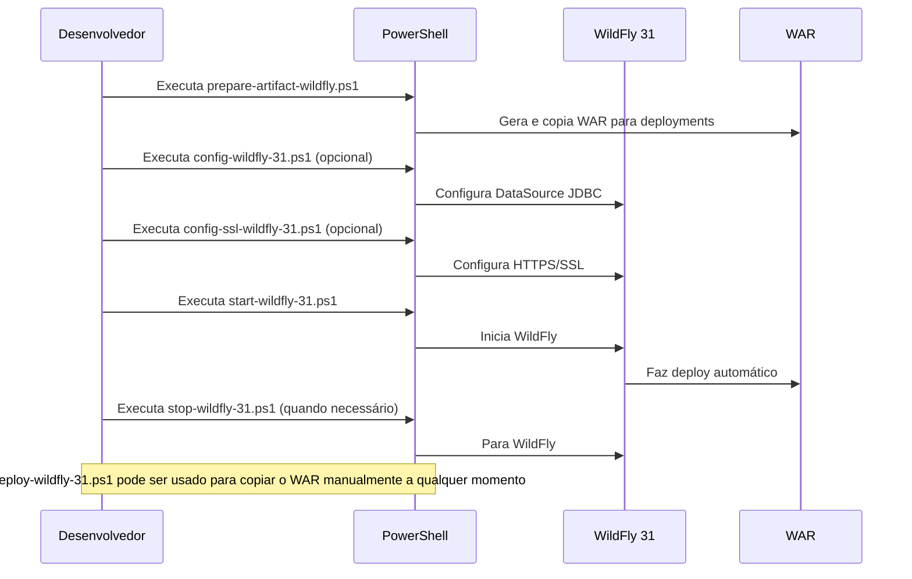

# CSOnline - Gestão CD (Centro de Distribuição) JWT 2.0

Sistema completo para gestão de centros de distribuição, entregas, entregadores, equipes, preços e comunicação via SMS/WhatsApp. Desenvolvido com Jakarta EE 10 no backend, Vue 3 + Vite no frontend e autenticação JWT enterprise.

 

## Pré-requisitos

- Java 17+ e Maven 3.9+
- Node.js 18+ e npm
- PowerShell 7+ (pwsh)
- WildFly 31 (já incluso em `server/`)
- Banco de dados HSQLDB (incluso; sem dependências externas)

## Configuração

- Backend (Jakarta EE 10):
   - Persistência HSQLDB já configurada em `src/main/resources/META-INF/persistence.xml` e `target/application.properties`.
   - Logs ajustáveis em `src/main/resources/log4j2.xml`.
   - Segurança JWT ativa em `/api/*`. Credenciais de teste: `admin/admin123`, `empresa/empresa123`.
- Frontend (Vue 3 + Vite):
   - Desenvolvimento: pasta `frontend/` (proxy configurado no `vite.config.js`).
   - Integração com backend: use `src/build-frontend.ps1` para copiar `dist/` para `src/main/webapp/`.
- Scripts de automação (PowerShell):
   - Deploy e operações em `./scr/*.ps1` e scripts raiz (start/stop/config/deploy/prepare).
   - Testes automatizados em `scr/tests/`.

## Testes Automatizados

O projeto inclui scripts de teste para validar autenticação JWT e endpoints da API:

### Scripts de Teste

- **`test-users.ps1`** - Testa endpoints de usuários com autenticação JWT (GET, POST, PUT, DELETE)
- **`test-customers.ps1`** - Testa endpoints de centros de distribuição com Bearer Token
- **`test-couriers.ps1`** - Testa endpoints de entregadores com JWT
- **`test-teams.ps1`** - Testa endpoints de equipes com autenticação
- **`test-deliveries.ps1`** - Testa endpoints de entregas protegidas
- **`test-sms.ps1`** - Testa endpoints de SMS/WhatsApp com JWT
- **`test-login.ps1`** - Testa endpoint de autenticação JWT
- **`test-frontend-integration.ps1`** - Teste integrado de múltiplos módulos (lista + shape + GET by ID + seeding de Teams)

### Ferramentas de Suporte

- **`test-jwt-security.ps1`** - **Suite completa com 20 testes de segurança JWT**
- **`jwt-utility.ps1`** - Funções utilitárias para operações JWT em PowerShell
- **`test-all-endpoints.ps1`** - Executa todos os testes com autenticação JWT
- **`health-check-endpoints.ps1`** - Verificação de saúde sem autenticação
- **`run-tests.ps1`** - **Script principal JWT 2.0** com opções de segurança
 - **`test-frontend-integration.ps1`** - Execução única ponta a ponta (users, couriers, customers, deliveries, teams, prices, sms)

### Como Executar os Testes

```powershell
# Teste completo de segurança JWT (recomendado)
.\run-tests.ps1 -JWTSecurity -Login "admin" -Password "admin123"

# Verificação rápida de saúde (sem JWT)
.\run-tests.ps1 -HealthCheck

# Executar todos os testes com autenticação JWT
.\run-tests.ps1 -AllTests -Login "admin" -Password "admin123"

# Executar teste específico com JWT
.\run-tests.ps1 -OnlyTest "users" -Login "admin" -Password "admin123"

# Testes verbosos com logs detalhados
.\run-tests.ps1 -JWTSecurity -Verbose -Login "admin" -Password "admin123"

# Integração completa (script unificado)
pwsh ./scr/tests/test-frontend-integration.ps1 -BaseUrl "http://localhost:8080/csonline" -Login "admin" -Password "admin123"
```

### Credenciais de Teste

- **admin/admin123** - Perfil administrativo
- **empresa/empresa123** - Perfil centro de distribuição

### Endpoints e Regras de Acesso
- **`/api/login`** - Autenticação JWT - PÚBLICO (200)
- **`/api/health`** - Health Check - PÚBLICO (200)
- **`/api/users`** - Gestão de usuários - PROTEGIDO JWT (GET requer ADMIN; outros perfis 403)
- **`/api/customers`** - Gestão de centros de distribuição - PROTEGIDO JWT (200)
- **`/api/couriers`** - Gestão de entregadores - PROTEGIDO JWT (200)
- **`/api/teams`** - Gestão de equipes - PROTEGIDO JWT (200)
- **`/api/deliveries`** - Gestão de entregas - PROTEGIDO JWT (200)
- **`/api/sms`** - Sistema de SMS/WhatsApp - PROTEGIDO JWT (200)

Observação: Endpoints retornarão 403 quando acessados sem a role adequada (por exemplo, `ADMIN`).

Todos os scripts estão localizados em `scr/tests/`.

## Como Executar

### **Front-end Vue SPA (Desenvolvimento)**

1. **Instale as dependências:**

   ```powershell
   cd frontend
   npm install
   ```
2. **Execute em modo desenvolvimento:**

   ```powershell
   npm run dev
   ```

   Acesse em [http://localhost:5173](http://localhost:5173) (porta padrão Vite).
3. **Build de produção:**

   ```powershell
   npm run build
   ```

   Os arquivos finais estarão em `frontend/dist`.
4. **Integrar build com backend:**

   ```powershell
   pwsh ./src/build-frontend.ps1
   ```

   Copia o conteúdo de `dist/` para `src/main/webapp/` e serve o SPA junto ao backend.

### **Backend + Deploy WildFly 31**

Scripts automatizados estão disponíveis na raiz do projeto para facilitar o deploy:

#### Diagrama de Sequência dos Scripts



**Ordem típica de execução:**

1. `prepare-artifact-wildfly.ps1` → Gera e copia WAR
2. `config-wildfly-31.ps1` (opcional) → Configura DataSource
3. `config-ssl-wildfly-31.ps1` (opcional) → Configura HTTPS
4. `start-wildfly-31.ps1` → Inicia servidor
5. `stop-wildfly-31.ps1` → Para servidor quando necessário

**Comandos detalhados:**

1. **Preparar o artefato WAR e copiar para o WildFly:**
   ```powershell
   pwsh ./prepare-artifact-wildfly.ps1 [-DskipTests]
   ```
   Gera o arquivo `target/csonline.war` e copia para `server\wildfly-31.0.1.Final\standalone\deployments`.

2. **Iniciar o WildFly:**
   ```powershell
   pwsh ./start-wildfly-31.ps1
   ```
   Inicia o WildFly 31 em http://localhost:8080/.

3. **Parar o WildFly:**
   ```powershell
   pwsh ./stop-wildfly-31.ps1
   ```

   Para o WildFly 31.
4. **Deploy manual do WAR (opcional):**

   ```powershell
   pwsh ./deploy-wildfly-31.ps1
   ```

   Copia o WAR para a pasta deployments do WildFly.
5. **Configurar DataSource JDBC (opcional):**

   ```powershell
   pwsh ./config-wildfly-31.ps1
   ```

   Copia o driver JDBC e configura o DataSource no WildFly (exemplo para HSQLDB).
6. **Configurar HTTPS/SSL (opcional):**

   ```powershell
   pwsh ./config-ssl-wildfly-31.ps1
   ```

   Gera certificado autoassinado e configura HTTPS (porta 8443).
   Após executar, acesse: https://localhost:8443/csonline/

## Acessos do Sistema

### **URLs Principais - Sistema JWT 2.0 Enterprise Seguro:**

- **Frontend SPA**: [http://localhost:5173](http://localhost:5173) (desenvolvimento com proxy JWT)
- **Sistema Enterprise**: [http://localhost:8080/csonline/](http://localhost:8080/csonline/) *(login JWT obrigatório)*
- **Login JWT**: [http://localhost:8080/csonline/api/login](http://localhost:8080/csonline/api/login) *(endpoint público)*
- **Swagger UI**: [http://localhost:8080/csonline/swagger-ui/](http://localhost:8080/csonline/swagger-ui/)
- **APIs Protegidas**: `http://localhost:8080/csonline/api/*` *(Bearer Token obrigatório)*
- **Health Check**: `http://localhost:8080/csonline/api/health` *(endpoint público)*

### **Módulos Disponíveis no Frontend JWT:**
- **Login** → Autenticação JWT obrigatória
- **Dashboard Principal** → Menu de navegação protegido
- **Usuários** → Gestão de administradores (JWT)
- **Entregadores** → Cadastro de couriers (JWT)
- **Centros de Distribuição** → Gestão de CDs (JWT)
- **Entregas** → Controle de entregas (JWT)
- **Equipes** → Times de entregadores (JWT)
- **SMS/WhatsApp** → Mensagens para entregas (JWT)
- **Preços** → Tabelas de preços (JWT)
- **Logout** → Saída segura do sistema

### **Credenciais de Teste JWT:**

- **admin/admin123** - Perfil administrativo completo
- **empresa/empresa123** - Perfil centro de distribuição

## Logging e Monitoramento

Os logs customizados da aplicação são gravados em `logs/app.log` (relativo à raiz do projeto, configurado via scripts e logging do WildFly).

Para visualizar o log:

- Acesse o arquivo diretamente: `logs/app.log`
- Ou, via CLI do WildFly:
  ```powershell
  pwsh ./config-log-wildfly-31.ps1   # (executa a configuração, se necessário)
  Get-Content ./logs/app.log -Wait   # (acompanha o log em tempo real)
  ```

Além disso, o log padrão do servidor WildFly está em:
`server/wildfly-31.0.1.Final/standalone/log/server.log`

Você pode ajustar o formato e destino do log customizado editando o script ou via console administrativo do WildFly.

## Documentação Completa

Consulte o arquivo [doc/INDEX.md](doc/INDEX.md) para documentação detalhada do projeto, incluindo:

- **Arquitetura do sistema**
- **Regras de negócio**
- **Guias de integração**
- **Documentação completa do frontend Vue**
- **Especificações de segurança**

## Estrutura do Projeto

### **Backend (Jakarta EE):**

- `src/main/java/com/caracore/cso/controller/` - Controllers REST
- `src/main/java/com/caracore/cso/service/` - Serviços de negócio
- `src/main/java/com/caracore/cso/repository/` - Repositórios JPA/EclipseLink
- `src/main/java/com/caracore/cso/entity/` - Entidades JPA
- `src/main/resources/` - Configurações (log4j2.xml, persistence.xml)
- `src/test/java/` - Testes unitários

### **Frontend (Vue 3 SPA):**

- `frontend/src/components/` - Componentes Vue
  - `Login.vue` - Tela de autenticação
  - `MainLayout.vue` - Layout principal com menu
  - `UserManagement.vue` - Gestão de usuários
  - `CourierManagement.vue` - Gestão de entregadores
  - `CustomerManagement.vue` - Gestão de centros de distribuição
  - `DeliveryManagement.vue` - Gestão de entregas
  - `TeamManagement.vue` - Gestão de equipes
  - `SMSManagement.vue` - Gestão de SMS/WhatsApp
  - `PriceManagement.vue` - Gestão de preços
  - `Logout.vue` - Tela de logout
- `frontend/dist/` - Build final do front-end
- `src/main/webapp/` - Frontend integrado ao backend

### **Scripts e Configurações:**

- `*.ps1` - Scripts PowerShell para deploy automatizado
- `scr/tests/` - **Suite completa de testes automatizados**
  - `test-*.ps1` - Scripts individuais para cada endpoint
  - `test-all-endpoints.ps1` - Script master para todos os testes
   - `test-frontend-integration.ps1` - Teste consolidado frontend-backend
  - `health-check-endpoints.ps1` - Verificação de saúde
  - `README-TESTES.ps1` - Documentação interativa dos testes
- `doc/` - Documentação completa do projeto
- `logs/` - Logs da aplicação

## Configuração

- **Backend:** Edite `src/main/resources/log4j2.xml` para ajustar logs e `src/main/resources/META-INF/persistence.xml` para configurar JPA/EclipseLink
- **Banco de dados:** HSQLDB em memória por padrão (configurável em `persistence.xml` e `application.properties`), sendo este o único banco de dados suportado pela aplicação
- **Frontend:** Customize os componentes Vue em `frontend/src/components/`
- **Deploy:** Use os scripts PowerShell na raiz para automação completa

## Próximos Passos

### **Com Segurança JWT 2.0 Enterprise Implementada, o foco agora é:**

#### **Autenticação JWT Enterprise - CONCLUÍDA:**
- **Sistema JWT completo** implementado e testado com 20 testes de segurança
- **Integração frontend-backend** com autenticação seamless Vue 3 + Jakarta EE
- **Proteção automática** de todos os endpoints `/api/*` com filtro de segurança
- **Tokens HMAC SHA-512** com expiração de 24 horas e validação robusta

#### **Próximas Evoluções de Produção:**
- **Operações CRUD Completas**: POST, PUT, DELETE com validação JWT em todos os módulos
- **Autorização por Perfis**: Controle granular de permissões baseado em roles JWT
- **Gestão Avançada de Usuários**: Criação, edição e desativação via interface autenticada
- **Auditoria de Segurança**: Logs detalhados de acesso, autenticação e operações

#### **Funcionalidades Enterprise Avançadas:**
- **Dashboard de Segurança**: Métricas de autenticação, tokens ativos e tentativas de acesso
- **Gestão de Tokens**: Renovação automática, blacklist e controle de sessões
- **Integração SSO**: Single Sign-On para ambientes corporativos
- **Monitoramento de Segurança**: Alertas em tempo real e relatórios de conformidade

### **Roadmap Estratégico JWT 2.0:**
1. **Segurança Enterprise** CONCLUÍDA (7 de Agosto/2025)
2. **Operações CRUD Autenticadas** (próxima milestone)
3. **Autorização Granular** (controle de permissões)
4. **Deploy Produção Seguro** (HTTPS + JWT enterprise)

## Contato

Para dúvidas, sugestões ou contribuições, abra uma issue no repositório.

---

## Licença

Este projeto está licenciado sob a licença MIT. Veja o arquivo [LICENSE](LICENSE) para mais detalhes.
