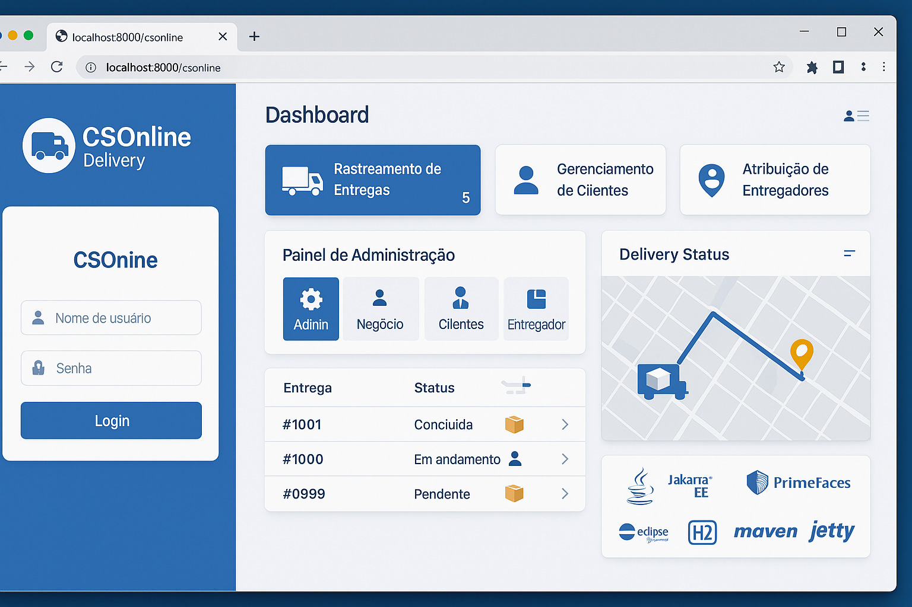

# CSOnline Delivery

Aplicação Web para controle de entregas.



## Descrição

CSOnline Delivery é uma aplicação desenvolvida em Java (SDK 11) utilizando Jakarta EE 10, Eclipse Mojarra 4.0.8 e PrimeFaces 14.0.0-jakarta para gerenciamento de entregas. O sistema roda em Jetty 11.0.17 embedded (desenvolvimento) ou Tomcat 10.1.x (produção) compatível com Jakarta EE 10, e utiliza H2 Database 2.3.232 (desenvolvimento) ou PostgreSQL 15 (produção) como banco de dados relacional.

Acesse via navegador: [https://www.caracore.com.br/csonline](https://www.caracore.com.br/csonline)

## Funcionalidades

- Cadastro e controle de entregas
- Perfil de administrador
- Interface web responsiva

## Tecnologias Utilizadas

- **Java 11**: SDK e configuração do projeto
- **Jakarta EE 10**: Plataforma empresarial Java com namespaces `jakarta.*`
- **PrimeFaces 14.0.0-jakarta**: Biblioteca de componentes JSF para Jakarta EE
- **Eclipse Mojarra 4.0.8**: Implementação de referência JSF para Jakarta EE
- **Weld 5.1.2.Final**: Implementação CDI (Contexts and Dependency Injection)
- **Jetty 11.0.17**: Servidor de aplicação para desenvolvimento (Maven Plugin)
- **Log4j 2.23.1**: Sistema de logging estruturado com rotação de arquivos
- **H2 Database 2.3.232**: Banco de dados em memória para desenvolvimento (modo PostgreSQL)
- **PostgreSQL 15**: Banco de dados relacional para produção

## Requisitos

- Java SDK 11
- Jakarta EE 10
- Maven 3.9.x ou superior
- H2 2.3.232 (para desenvolvimento) ou PostgreSQL 15 (para produção)
- Dependências principais (gerenciadas pelo Maven):
  - PrimeFaces 14.0.0-jakarta (Jakarta EE compatível)
  - Eclipse Mojarra 4.0.8 (implementação de referência JSF)
  - Weld 5.1.2.Final (CDI para Jakarta EE)
  - Jetty 11.0.17 (desenvolvimento via Maven Plugin)
  - Log4j 2.23.1 (logging estruturado)
  - H2 Database 2.3.232 (desenvolvimento com modo PostgreSQL)

## Instalação e Execução

### Desenvolvimento (Jetty Embedded)

1. Clone o repositório:

   ```bash
   git clone <repository-url>
   cd csonline
   ```

2. Compile, empacote e execute com Jetty embedded:

   ```bash
   mvn clean package jetty:run -DskipTests
   ```

   **Ou execute em etapas separadas:**

   ```bash
   # Primeiro compile e gere o WAR
   mvn clean package -DskipTests
   
   # Depois inicie o servidor
   mvn jetty:run
   ```

3. **Aguarde a inicialização completa:**

   ```text
   [INFO] Eclipse Mojarra JSF implementation started successfully.
   [INFO] Running on PrimeFaces 14.0.0
   [INFO] Banco H2 inicializado com sucesso.
   [INFO] Weld initialization completed successfully
   ```

4. **Acesse a aplicação:**
   - URL: <http://localhost:8080/csonline>
   - Usuário: `chmulato`
   - Senha: `admin`

### Base de Dados H2 (Desenvolvimento)

A aplicação utiliza H2 Database em modo PostgreSQL para desenvolvimento:

- **URL de conexão**: `jdbc:h2:~/csonline;MODE=PostgreSQL;DATABASE_TO_UPPER=false`
- **Localização**: `~/csonline.mv.db` (diretório home do usuário)
- **Inicialização automática**: Script SQL executado via `DatabaseInitializer`
- **Dados de teste incluídos**: Usuários, clientes, entregadores e preços

**Usuários disponíveis para teste:**

- **Admin**: `chmulato` / `admin`
- **Business**: `pmulato` / `admin`, `joao` / `admin`
- **Customer**: `mariosa` / `admin`, `santasa` / `admin`
- **Courier**: `mane` / `admin`

### Logs do Jetty Embedded

Os logs são exibidos diretamente no terminal onde você executou `mvn jetty:run`. Para logs mais detalhados:

**Logs da aplicação:**

```text
logs/
├── csonline.log          ← Log principal da aplicação
├── csonline.2025-07-22.1.gz  ← Logs arquivados (rotação diária)
└── archived/             ← Logs antigos (máx. 10 arquivos)
```

**Localização dos logs do servidor:**

```text
target/
├── jetty-temp/           ← Arquivos temporários do Jetty
├── classes/              ← Classes compiladas
└── csonline/             ← Aplicação expandida (WAR)
    ├── WEB-INF/
    └── resources/
```

**Logs do Jetty:**

Os logs do Jetty são exibidos diretamente no terminal onde você executou `mvn jetty:run`. Não há arquivos de log separados do servidor para desenvolvimento, apenas os logs da aplicação em `logs/csonline.log`.

**Visualizar logs em tempo real:**

```bash
# No Windows (PowerShell)
Get-Content logs/csonline.log -Wait

# Ou monitore via terminal onde está executando mvn jetty:run
```

**Configuração de log level:**

Edite `src/main/resources/log4j2.xml` para ajustar níveis:

```xml
<Logger name="br.com.mulato" level="DEBUG" additivity="false">
<!-- Para mais detalhes: level="TRACE" -->
```

### Configuração do Log4j 2

A aplicação utiliza **Log4j 2.23.1** para logging. A configuração está em `src/main/resources/log4j2.xml`:

- **Logs da aplicação**: `logs/csonline.log`
- **Console output**: Logs também aparecem no terminal
- **Log rotation**: Arquivos rotacionados diariamente (máx. 100MB cada)
- **Levels configurados**:
  - `br.com.mulato.*`: DEBUG (código da aplicação)
  - `jakarta.faces`, `org.primefaces`: INFO
  - `org.jboss.weld`: INFO (CDI)
  - Root logger: INFO

**Ajustar níveis de log:**

Edite `src/main/resources/log4j2.xml` e altere os levels conforme necessário:

```xml
<Logger name="br.com.mulato" level="DEBUG" additivity="false">
<!-- Para mais detalhes, use: level="TRACE" -->
```

### Parar a Aplicação

**Scripts de gerenciamento disponíveis:**

```powershell
# Parar o servidor (Windows PowerShell)
.\stop-csonline.ps1

# Iniciar o servidor (Windows PowerShell)  
.\start-csonline.ps1
```

**Manualmente:**

- Pressione `Ctrl+C` no terminal onde está executando
- Ou force o encerramento: `taskkill /F /IM java.exe` (Windows)

### Solução de Problemas

Se encontrar problemas com a aplicação:

```powershell
# Usando scripts PowerShell (Windows)
.\stop-csonline.ps1
.\start-csonline.ps1

# Ou limpe e reinicie completamente
taskkill /F /IM java.exe
mvn clean package jetty:run -DskipTests
```

**Problemas comuns:**

1. **Porta 8080 ocupada**: Verificar se outra aplicação está usando a porta
2. **H2 Database lock**: Fechar conexões existentes antes de reiniciar
3. **Dependências**: Executar `mvn clean` para limpar cache Maven
4. **Recursos JSF não carregam**: Verificar configuração `jakarta.faces.RESOURCE_EXCLUDES` no web.xml
5. **Temas PrimeFaces**: Verificar se `nova-light` está disponível nos recursos
6. **Seletor de temas não funciona**: O sistema possui dois gerenciadores de temas:
   - ThemeBean (#{themeMB}) - Usado no login.xhtml
   - ThemeSwitcherBean (#{themeSwitcherBean}) - Usado no theme.xhtml
   - Verificar parâmetro `themeDefault` no web.xml e propriedade `client.theme_application` no config.properties

### Verificação da Instalação

Após executar `mvn clean package`, verifique se os arquivos foram criados:

```text
target/
├── csonline.war          ← Arquivo WAR principal
├── csonline/             ← Aplicação expandida
│   ├── WEB-INF/
│   │   ├── lib/          ← Dependências (PrimeFaces, Mojarra, etc.)
│   │   ├── classes/      ← Classes compiladas
│   │   └── web.xml       ← Configuração web
│   └── resources/        ← Recursos estáticos
└── classes/              ← Classes compiladas do projeto
```

**Logs de Sucesso Esperados:**

```text
INFO: Banco H2 inicializado com sucesso.
INFO: Eclipse Mojarra JSF implementation started successfully.
INFO: Running on PrimeFaces 14.0.0
INFO: Weld initialization completed successfully
INFO: Started Server@... HTTP/1.1, (http/1.1)}{0.0.0.0:8080}
```

### Produção (Deploy WAR)

1. Gere o arquivo WAR:

   ```bash
   mvn clean package -DskipTests
   ```

2. Configure o banco de dados PostgreSQL 15 conforme os scripts em `doc/dump/`.

3. Faça o deploy do WAR (`target/csonline.war`) em um Tomcat 10.1.x ou superior configurado para Jakarta EE.

## Migração para Jakarta EE

Este projeto foi migrado do Java EE (`javax.*`) para Jakarta EE 10 (`jakarta.*`). Principais mudanças:

- PrimeFaces atualizado para 14.0.0-jakarta
- JSF agora usa Eclipse Mojarra 4.0.8
- CDI com Weld 5.1.2.Final
- Banco H2 ajustado para compatibilidade com Jakarta EE
- Log4j atualizado para 2.23.1
- Ambiente de desenvolvimento e produção padronizado para Tomcat 10.1.x ou superior
- Dependências e configurações atualizadas para `jakarta.*`
- Scripts PowerShell para iniciar/parar servidor

A aplicação não utiliza JNDI/DataSource do Tomcat. Toda a conexão com banco é feita via JDBC direto no código Java.

## Perfil de Administrador

- Usuário: `chmulato`
- Senha: `admin`

## Demonstração

Veja no Youtube: [https://youtu.be/vAMd647anMA](https://youtu.be/vAMd647anMA)

## Licença

Este projeto está licenciado sob a Licença MIT. Consulte o arquivo LICENSE para mais detalhes.

## Autor

Christian Vladimir Uhdre Mulato

## Contato

Para dúvidas ou sugestões, entre em contato pelo site ou pelo e-mail disponível no perfil do autor.
