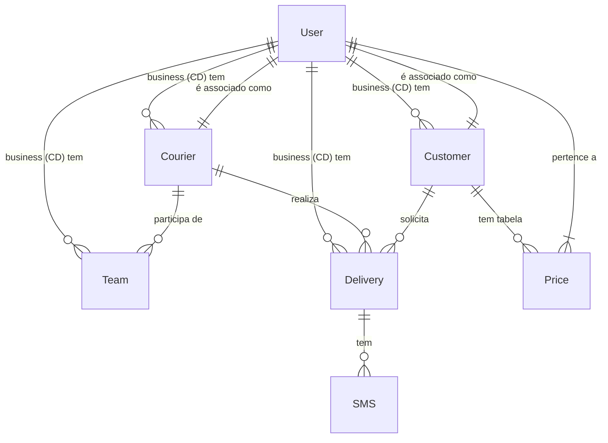
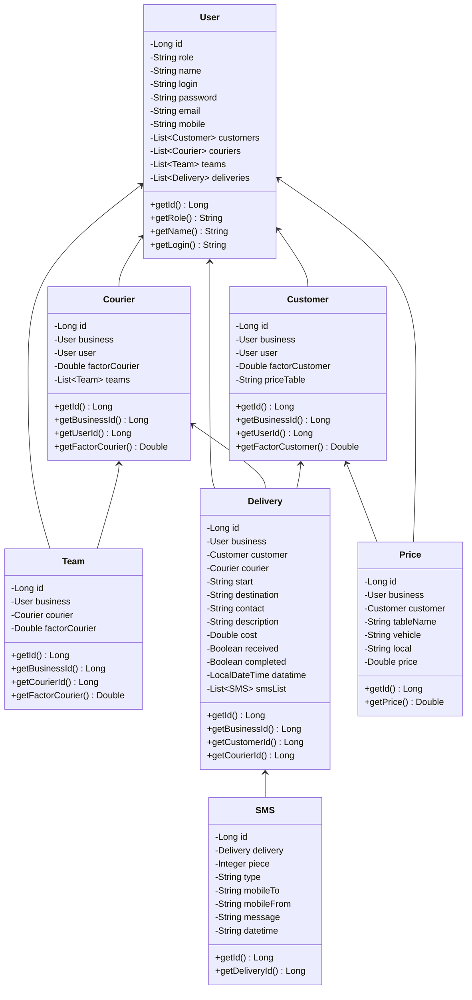

# Modelo de Dados - CSOnline

Este documento descreve as entidades do sistema CSOnline e suas relações, fornecendo uma visão geral da estrutura de dados do aplicativo.

## Diagrama de Entidade-Relacionamento



## Diagrama de Classes



## Entidades e Relacionamentos

### User
A entidade central do sistema que representa usuários com diferentes funções (BUSINESS/Centro de Distribuição, COURIER, CUSTOMER).

**Campos principais:**
- `id`: Identificador único
- `role`: Função do usuário (BUSINESS/Centro de Distribuição, COURIER, CUSTOMER)
- `name`: Nome do usuário
- `login`: Nome de usuário único para login
- `password`: Senha do usuário
- `email`, `email2`, `address`, `mobile`: Informações de contato

**Relacionamentos:**
- `1:N` com Customer: Um usuário do tipo BUSINESS (Centro de Distribuição) pode ter vários clientes
- `1:N` com Courier: Um usuário do tipo BUSINESS (Centro de Distribuição) pode ter vários entregadores
- `1:N` com Team: Um usuário do tipo BUSINESS (Centro de Distribuição) pode ter várias equipes
- `1:N` com Delivery: Um usuário do tipo BUSINESS (Centro de Distribuição) pode ter várias entregas

### Courier
Representa um entregador no sistema.

**Campos principais:**
- `id`: Identificador único
- `factorCourier`: Fator de remuneração do entregador

**Relacionamentos:**
- `N:1` com User (business/Centro de Distribuição): Um entregador pertence a um Centro de Distribuição
- `N:1` com User (user): Um entregador está associado a um usuário
- `1:N` com Team: Um entregador pode participar de várias equipes
- `1:N` com Delivery: Um entregador pode realizar várias entregas

### Customer
Representa um cliente no sistema.

**Campos principais:**
- `id`: Identificador único
- `factorCustomer`: Fator de cobrança do cliente
- `priceTable`: Tabela de preços associada ao cliente

**Relacionamentos:**
- `N:1` com User (business/Centro de Distribuição): Um cliente pertence a um Centro de Distribuição
- `1:1` com User (user): Um cliente está associado a um usuário
- `1:N` com Delivery: Um cliente pode solicitar várias entregas
- `1:N` com Price: Um cliente pode ter várias tabelas de preço

### Team
Representa uma equipe formada por um Centro de Distribuição (BUSINESS) e um entregador.

**Campos principais:**
- `id`: Identificador único
- `factorCourier`: Fator de remuneração específico para esta equipe

**Relacionamentos:**
- `N:1` com User (business/Centro de Distribuição): Uma equipe pertence a um Centro de Distribuição
- `N:1` com Courier: Uma equipe contém um entregador

### Delivery
Representa uma entrega realizada no sistema.

**Campos principais:**
- `id`: Identificador único
- `start`: Local de início da entrega
- `destination`: Destino da entrega
- `contact`: Contato no destino
- `description`: Descrição da entrega
- `volume`, `weight`, `km`: Características físicas da entrega
- `additionalCost`, `cost`: Custos associados
- `received`, `completed`: Status da entrega
- `datatime`: Data e hora da entrega

**Relacionamentos:**
- `N:1` com User (business/Centro de Distribuição): Uma entrega pertence a um Centro de Distribuição
- `N:1` com Customer: Uma entrega é solicitada por um cliente
- `N:1` com Courier: Uma entrega é realizada por um entregador
- `1:N` com SMS: Uma entrega pode ter vários SMS associados

### SMS
Representa mensagens SMS enviadas no contexto de uma entrega.

**Campos principais:**
- `id`: Identificador único
- `piece`: Número da peça/item
- `type`: Tipo de SMS
- `mobileTo`, `mobileFrom`: Números de telefone
- `message`: Conteúdo da mensagem
- `datetime`: Data e hora do envio

**Relacionamentos:**
- `N:1` com Delivery: Um SMS está associado a uma entrega

### Price
Representa informações de preço para entregas.

**Campos principais:**
- `id`: Identificador único
- `tableName`: Nome da tabela de preços
- `vehicle`: Tipo de veículo
- `local`: Localidade
- `price`: Valor do preço

**Relacionamentos:**
- `N:1` com User (business/Centro de Distribuição): Um preço pertence a um Centro de Distribuição
- `N:1` com Customer: Um preço pode estar associado a um cliente específico

## Regras de Negócio Importantes

1. **Hierarquia de Usuários**:
   - Usuários com papel BUSINESS (Centro de Distribuição) podem gerenciar clientes, entregadores e entregas
   - Usuários com papel COURIER estão associados a entregadores
   - Usuários com papel CUSTOMER estão associados a clientes

2. **Formação de Equipes**:
   - Uma equipe é formada pela associação entre um Centro de Distribuição (BUSINESS) e um entregador (Courier)
   - O fator do entregador na equipe pode ser diferente do fator padrão do entregador

3. **Gestão de Entregas**:
   - Uma entrega sempre tem um cliente solicitante e um entregador designado
   - Cada entrega pode ter múltiplas mensagens SMS associadas
   - Os preços podem variar conforme a tabela de preços do cliente

4. **Precificação**:
   - Os preços podem ser personalizados por cliente
   - Fatores de multiplicação podem ser aplicados por cliente ou entregador

## Observações Técnicas

- Anotações `@JsonIgnore` e `@JsonIgnoreProperties` são usadas para controlar a serialização/desserialização JSON e evitar referências circulares
- Propriedades adicionais como `businessId`, `userId`, etc. são expostas via `@JsonProperty` para facilitar a manipulação dos dados no frontend
- As cascatas de exclusão (CascadeType.REMOVE) estão configuradas para manter a integridade referencial

## Exemplo de SQL para Consultas Comuns

```sql
-- Listar todos os entregadores de um business
SELECT c.*, u.name, u.login, u.email 
FROM courier c 
JOIN app_user u ON c.idcourier = u.id 
WHERE c.idbusiness = :businessId;

-- Listar todas as entregas para um cliente específico
SELECT d.* 
FROM delivery d 
WHERE d.idcustomer = :customerId;

-- Obter todas as equipes com seus entregadores
SELECT t.*, u.name as courier_name 
FROM team t 
JOIN courier c ON t.idcourier = c.id 
JOIN app_user u ON c.idcourier = u.id 
WHERE t.idbusiness = :businessId;

-- Listar SMS para uma entrega específica
SELECT s.* 
FROM sms s 
WHERE s.iddelivery = :deliveryId 
ORDER BY s.piece;
```

## Boas Práticas para Trabalhar com o Modelo

### Serialização JSON

Para evitar referências circulares durante a serialização JSON, é importante:

1. Usar anotações `@JsonIgnore` nas propriedades que causam ciclos
2. Expor IDs via métodos anotados com `@JsonProperty` para manter a referência no JSON
3. Considerar o uso de DTOs para transferências de dados mais complexas (como em DeliveryDTO)

### Cascata de Operações

O modelo usa cascatas (CascadeType.REMOVE) em várias relações:

```java
@OneToMany(mappedBy = "business", cascade = CascadeType.REMOVE, orphanRemoval = true)
@JsonIgnore
private List<Customer> customers;
```

Isso significa que:
- Ao excluir um usuário business (Centro de Distribuição), seus clientes serão excluídos automaticamente
- É preciso ter cuidado ao excluir entidades para evitar exclusões não intencionais em cascata

### Carregar Relações Lazy vs Eager

As relações são configuradas para carregamento lazy por padrão. Para cenários onde é necessário carregar relações:

```java
// Exemplo em JPA/JPQL
User userWithCouriers = em.createQuery(
    "SELECT u FROM User u LEFT JOIN FETCH u.couriers WHERE u.id = :id", 
    User.class)
    .setParameter("id", userId)
    .getSingleResult();
```

### Testes

Ao testar relacionamentos entre entidades, siga este fluxo:

1. Criar e persistir o usuário business (Centro de Distribuição)
2. Criar e persistir outros usuários (courier, customer)
3. Criar entidades relacionadas (Courier, Customer) com referências aos usuários
4. Criar entidades de operação (Team, Delivery) com referências às entidades principais
